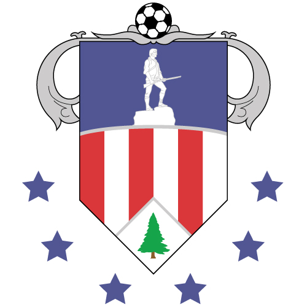
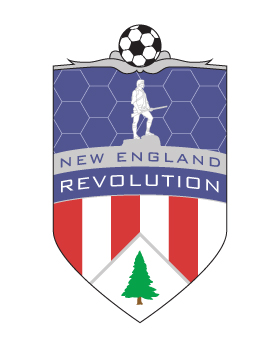
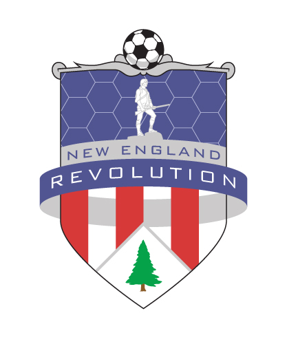

Ever since I read M. Willis’s expansive and thoughtful [rebranding of the New England Revolution](http://mwl.li/rev-reboot), I've been contemplating what _I'd_ do with the Revs’ branding if given the chance. I liked a lot of Willis’s thought process, but more than that it sparked my own imagination. So as an exercise I thought I'd try my own hand. This is going to be a lot shorter, but I'm still going to try to explain my reasoning and methods as best as I can. Hopefully it's interesting, if nothing else. **If you're mostly just interested in the final outcome, just scroll to the bottom.**

I love the Revolution, but from day one I've been unimpressed by their current crayon-style logo. And last year's Patriots-themed (down to the [pseudo-shoulder-pads](http://a.espncdn.com/espn360/images/so/mls/202830.jpg)) kits were a pretty big disappointment, visually and metaphorically.[^1] Still, I'm a Pats fan as well, and if it were toned down and the Revs allowed to grow and thrive on their own, I think I would cherish the connection, the shared theme, between my two favorite teams.

With this in mind, I set out to rebuild the Revs’ logo. I decided that unlike Willis, I wouldn't change the name or basic identity of the team – I'd just try to solidify it, give it some dignity. I wanted to hypothetically pull the team out of the 90’s, out of the realm of struggling fifth-tier sport and into one of real, top-class professional athletes.

<!--more-->

I started with a banner, a battle standard. This would allow me to keep some of the coat-of-arms aesthetic and familiar shield shape of other logos in the league, while staying true to the identity of the New England Revolution. I did some research, and came up with a rough, semi-ornate standard, drawing visually from the American flag (in part a nod to the current logo) and from actual standards from the Revolutionary War.

I didn't round it out, because I knew I wasn't going to use it as the final version and the more I worked, the less I really liked it. It was overly-complicated, and still without conveying everything I wanted to. But most of the basic elements were there:

- The minuteman
- The stars and stripes
- The tree from the [Flag of New England](http://en.wikipedia.org/wiki/File:New_England_pine_flag.svg) (featured on the new jerseys, and first brought to my attention by Willis)
- The banner and the pole from which the banner would hang
- The theme of sixes, representing the six states
- The soccer ball[^2]

The most glaring omission was the team's name. I decided to save what I'd done and head in a different direction – something a bit more sleek and “modern,” more MLS-friendly.

I rounded the bottom corners of the flag, and decided to lose the stars and the flourishes on the crossbeam from which the flag was to hang. The blue behind the Lexington Minuteman seemed a bit empty, and I considered how much modern sports love subtle textures, so I added a thin honeycomb over the blue to imply/echo the stitch of the soccer ball.

I also added the team name. I'm not incredibly happy with the typeface – Bank Gothic – but I ended up sticking with it for two reasons: it seemed to fit the design, and more than that, it seemed like a typeface that MLS, and the Revolution, might actually use. Look at the font MLS has chosen to use on all jerseys for names and numbers – it aspires to be modern and edgy, without entirely being either. It seems to be based on a kind of dated idea of the modern aesthetic. I think this typeface has some of these same traits, unfortunately, but my hope is that it leans that way just enough and then gets out of the way without distracting from the rest of the design.

From here, the next thing I tried to do was bring some depth to the image. From the start, I'd envisioned at least part of the name being on a banner, à la [Toronto FC](http://www.sportslogos.net/logo.php?id=0gfaomjubvw58whdep6w). In creating this effect though, I stumbled upon something I liked much more. This ring that I had created added interest and depth to the image that had definitely been missing before. I also kind of liked how it implied another form of the word “revolution” - that is, it encircled the rest of the logo.

You can see that I also toyed with the silver crossbar at the top, trying to give it some depth and make it more recognizable as a beam from which the flag was hanging. But it still wasn't working for me. I still had a few more things I wanted to accomplish – I wanted to fix that crossbar; to add more depth; and I really wanted to get a fox in there somehow.

Yes, a fox. I know, and I'll be the first person to criticize Slyde the Fox (the Revs’ mascot because Gillette Stadium is in Foxboro, MA), and his ridiculous new snark-face – which looks exactly like every character I drew in high school. No, really, [look](http://confused.bensaufley.com/64). But I'm approaching this from two ways:

1. On a basic aesthetic level, I liked the idea of an animal that could represent the area being used on the standard. A lot of crests and standards make use of various symbolic animals. I considered the dissected snake from Benjamin Franklin’s famous “JOIN, OR DIE” [cartoon](http://en.wikipedia.org/wiki/Join,_or_Die), but that referred to colonies all down the coast – plus there's the whole “Sons of Ben” thing in Philadelphia.
2. The Revolution has 16+ years of history, and that includes Slyde the Fox. Silly as he may be, I want to embrace that history, not run from it. And what better way than to really bring the fox into the team's identity?

And that was how I arrived here.

The final outcome reincorporates the six stars that were lost from the first draft on a field of green that not only implies the pitch, but brings the green of the tree back into the composition. The soccer ball has been diminished, and upon it sits the red fox. The crossbeam has been greatly simplified, and now tucks behind the banner to give some more depth at the top of the image. At the bottom, a thicker border has been added to the flag. This gives it a more solid presence, but it does tip it back toward the “shield” aesthetic. Above the fox, in the same color as the crossbar, is the Bunker Hill Monument, which also hints at the top of the pike on which a standard would be mounted.

The final composition uses just four colors (besides white): red, silver, blue, and green. This concerned me, because most of the logos in the league seem to use a max of three colors beyond white. But this rule does not apply to all logos in the league ([Chivas USA](http://www.sportslogos.net/logo.php?id=03zmnqeyastoeb3leeyoen7kr), for example), and I think the simplicity and usage of the color scheme justifies itself.

Of course, floating the logo in white space doesn't present it in its ideal form. I made one last pass at it to give it some depth and substance with subtle gradients and other small, optional effects, and placed it on a background that helped it stand out. Here’s the final result – what I would do with the New England Revolution’s logo if it were up to me:

[^1]: The team has a hard time fighting its reputation as the Pats’ shunned step-brother, and the Krafts have recently done little to prove otherwise.

[^2]: I went back and forth on whether to include this, and decided it should be there, partially as a nod to the current logo and partially to distinguish the logo out of context. The Revs aren't the only team in the league that feature a soccer ball in their logo.
